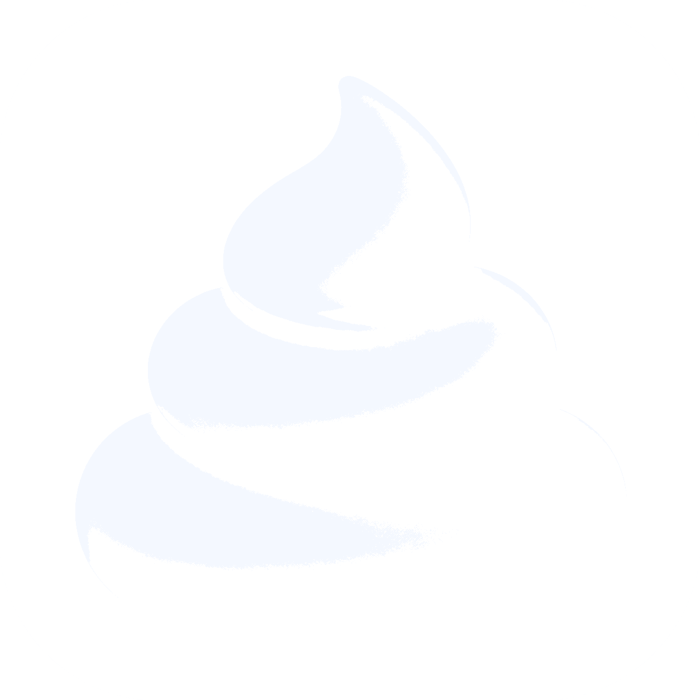

<div align="center">



# SHIT VAULT

Windows tray-first utility shell for auto mixing, prevent sleep, and small native tools.

[Website](https://dave-oioioi.github.io/SHIT/) |
[Release](https://github.com/Dave-oioioi/SHIT/releases/tag/v1.1.0) |
[Download Installer](https://github.com/Dave-oioioi/SHIT/releases/download/v1.1.0/SHIT.VAULT_1.1.0_x64-setup.exe)

</div>

<div align="center">

`v1.1.0` | `Windows x64` | `Tauri 2` | `React` | `TypeScript` | `Rust`

</div>

SHIT VAULT is a desktop utility vault built for fast daily use on Windows. It lives in the tray, opens on demand, stays out of the way when you do not need it, and keeps native behavior in Rust where it belongs.

The current first-stage release centers on two modules:

- `auto-mixing`: automatically ducks selected apps when other apps start speaking
- `prevent-sleep`: a frozen native keepalive module with protected behavior

## Product Snapshot

<table>
  <tr>
    <td width="33%">
      <strong>Tray First</strong><br />
      Starts hidden, opens from the tray, hides on close, hides on focus loss, and supports <code>Esc</code> to dismiss.
    </td>
    <td width="33%">
      <strong>Native Windows Behavior</strong><br />
      Audio-session monitoring, keepalive control, installer behavior, and shell plumbing run through Tauri and Rust.
    </td>
    <td width="33%">
      <strong>Single Focused Shell</strong><br />
      A compact shell that keeps modules isolated instead of leaking feature logic into global layout code.
    </td>
  </tr>
</table>

## Current Modules

### Auto Mixing

The `auto-mixing` module is the main v1.1 feature.

- choose which apps should be ducked
- exclude apps that should never trigger ducking
- optionally let system sounds act as triggers
- monitor both default multimedia and communications endpoints
- tune ducked volume with the ducked-volume slider
- tune both duck-in and restore timing with the fade-timing slider

The latest UI pass keeps the controls compact: the sliders live above the app-selection section, match the shell card language, and stay visible but disabled while the module is running.

### Prevent Sleep

`prevent-sleep` is complete and frozen.

- native Windows keepalive behavior
- protected command semantics
- locked product behavior unless explicitly reopened

Future work for this module is UI-only unless the feature is intentionally reopened.

## Shell Behavior

SHIT VAULT is designed as a tray app first, not a normal always-open desktop window.

- app starts hidden
- tray left click reveals the shell
- tray menu supports open, settings, and quit actions
- shell opens as a compact bottom-right utility surface
- only one `shit-vault.exe` instance can run at a time
- repeated launch reveals the existing instance instead of spawning a second process

## Download

### Public links

- Website: `https://dave-oioioi.github.io/SHIT/`
- Release page: `https://github.com/Dave-oioioi/SHIT/releases/tag/v1.1.0`
- Installer: `https://github.com/Dave-oioioi/SHIT/releases/download/v1.1.0/SHIT.VAULT_1.1.0_x64-setup.exe`

### Local build outputs

```text
src-tauri/target/release/shit-vault.exe
src-tauri/target/release/bundle/nsis/SHIT VAULT_1.1.0_x64-setup.exe
```

## Development

Install dependencies:

```bash
npm install
```

Run the frontend dev server:

```bash
npm run dev
```

Run the Tauri desktop app:

```bash
npm run tauri:dev
```

Run tests:

```bash
npm test
```

Build the frontend:

```bash
npm run build
```

Build the release exe without bundling:

```bash
npm run tauri:build-exe
```

Build the NSIS installer:

```bash
npm run tauri:build
```

If `cargo` is missing in the current PowerShell session:

```powershell
$env:PATH = "$env:USERPROFILE\.cargo\bin;$env:PATH"
```

## Verification

Run before release sync:

```bash
npm run check:release
```

## Project Structure

```text
src/
  app/
    hooks/
    registry/
    shell/
    state/
    ui/
  modules/
    auto-mixing/
    prevent-sleep/
src-tauri/
  nsis/
  src/
    auto_mixing.rs
    main.rs
    prevent_sleep.rs
docs/
release-page/
assets/
```

## Module Contract

Every module exports a `ModuleDefinition` from `module.ts`:

- `manifest`
- `CardComponent`
- `SettingsComponent`
- `defaultState`
- `defaultSettings`

The shell discovers modules through the registry. Feature logic should stay inside `src/modules/<module-id>/` and the corresponding Tauri/Rust boundary instead of being pushed into `AppShell`, `DashboardPage`, tray code, or global layout code.

## Docs

- [Agent Operating Guide](./AGENTS.md)
- [Project Handoff](./docs/HANDOFF.md)
- [Auto Mixing UI Polish](./docs/handoff-auto-mixing-ui-polish.md)
- [Auto Mixing Tuning Controls](./docs/handoff-auto-mixing-slider-plan.md)
- [1.1 Release Handoff](./docs/handoff-v1.1-release.md)
- [Prevent Sleep PRD](./docs/PRD-prevent-sleep.md)
